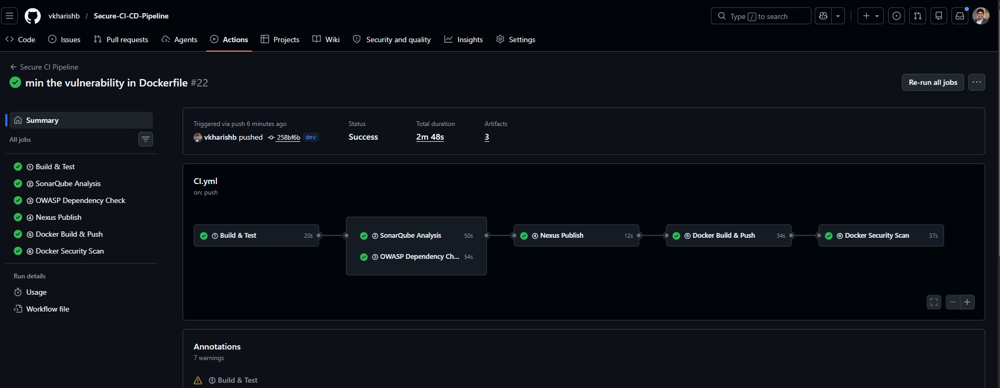

# 🔐 Secure CI/CD Pipeline

> **Production-grade DevSecOps pipeline** for a Node.js application — dual-engine (GitHub Actions + Jenkins), with SonarQube SAST, OWASP dependency scanning, Nexus artifact publishing, Docker containerisation, and Trivy image security scanning baked in at every stage.

[](https://github.com/vkharishb/Secure-CI-CD-Pipeline/actions/workflows/CI.yml)


---

## 📋 Table of Contents

- [Project Overview](#-project-overview)
- [Pipeline Architecture](#-pipeline-architecture)
- [Technology Stack](#-technology-stack)
- [Repository Structure](#-repository-structure)
- [GitHub Actions — CI Pipeline](#-github-actions--ci-pipeline)
  - [Stage 1 — Build & Test](#stage-1--build--test)
  - [Stage 2 — SonarQube Analysis](#stage-2--sonarqube-analysis)
  - [Stage 3 — OWASP Dependency Check](#stage-3--owasp-dependency-check)
  - [Stage 4 — Nexus Publish](#stage-4--nexus-publish)
  - [Stage 5 — Docker Build & Push](#stage-5--docker-build--push)
  - [Stage 6 — Docker Security Scan (Trivy)](#stage-6--docker-security-scan-trivy)
- [Jenkins Pipeline](#-jenkins-pipeline)
- [Dockerfile — Security Hardened](#-dockerfile--security-hardened)
- [Proof of Execution — CI Run #22](#-proof-of-execution--ci-run-22)
- [Branch Strategy](#-branch-strategy)
- [Required GitHub Secrets](#-required-github-secrets)
- [Local Development](#-local-development)
- [Future Enhancements](#-future-enhancements)
- [Author](#-author)

---

## 🎯 Project Overview

This project implements a **secure DevSecOps CI/CD pipeline** that enforces security at every gate — from the first line of code to the final Docker image pushed to production. The pipeline runs automatically on pushes to `dev` and `main`, and is designed to catch vulnerabilities **before** they reach production.

**What it automates:**

- Dependency installation, unit testing, and coverage gating
- Static application security testing (SAST) via SonarQube Cloud
- Software composition analysis (SCA) via OWASP Dependency Check
- Snapshot artifact publishing to Nexus Repository
- Multi-stage Docker image build and push to Docker Hub
- Container image vulnerability scanning via Trivy with SARIF upload to GitHub Security tab

---

## 🏗 Pipeline Architecture

```
Developer Push  ──►  GitHub (dev / main)
                           │
                    GitHub Actions
                           │
          ┌────────────────┼────────────────┐
          │                │                │
    ① Build & Test   ② SonarQube    ③ OWASP Dep Check
      (parallel)      Analysis         (parallel)
          │                │                │
          └────────────────┴────────────────┘
                           │
                    ④ Nexus Publish
                           │
                    ⑤ Docker Build & Push
                           │
                    ⑥ Trivy Security Scan
                    (SARIF → GitHub Security Tab)
```

**Jenkins pipeline** (for on-prem / enterprise environments) adds:

```
① Checkout  →  ② Build  →  ③ SonarQube  →  ④ Black Duck SCA
→  ⑤ Nexus Snapshot  →  ⑥ Docker Build  →  ⑦ Trivy Scan
→  ⑧ Docker Hub Push  →  ⑨ UAT Deploy (manual approval gate)
```

---

## 🛠 Technology Stack

| Category | Tool | Purpose |
|---|---|---|
| CI/CD (cloud) | GitHub Actions | Automated pipeline on push |
| CI/CD (on-prem) | Jenkins + Kubernetes agent | Enterprise pipeline |
| Runtime | Node.js 20 + Alpine | Application runtime |
| SAST | SonarQube Cloud | Code quality & security hotspots |
| SCA | OWASP Dependency Check | CVE scanning of npm dependencies |
| SCA (enterprise) | Black Duck | Deep open-source risk analysis |
| Container | Docker (multi-stage) | Secure, minimal production image |
| Container Security | Trivy (Aqua Security) | Image vulnerability scanning |
| Artifact Store | Nexus Repository Manager | Snapshot npm artifact publishing |
| Testing | Jest | Unit tests + coverage reporting |
| Signal handling | dumb-init | Correct PID 1 / SIGTERM handling |

---

## 📁 Repository Structure

```
Secure-CI-CD-Pipeline/
├── .github/
│   └── workflows/
│       └── CI.yml              # GitHub Actions pipeline
├── Doc/                        # Documentation assets
├── public/                     # Static assets
├── src/
│   ├── controllers/
│   ├── middleware/
│   ├── routes/
│   ├── utils/
│   ├── app.js
│   └── index.js
├── tests/                      # Jest test suites
├── .dockerignore
├── .gitignore
├── Dockerfile                  # Multi-stage, security-hardened
├── Jenkinsfile                 # 9-stage Jenkins pipeline
├── build.js
├── package.json
├── package-lock.json
└── README.md
```

---

## ⚙️ GitHub Actions — CI Pipeline

Pipeline file: `.github/workflows/CI.yml`
Triggers: `push` to `dev` or `main`

### Stage 1 — Build & Test

Installs dependencies via `npm ci`, runs the Jest test suite with full coverage reporting, and produces build artefacts.

```bash
npm ci
npm test -- --coverage --coverageReporters=lcov --coverageReporters=text --forceExit
npm run build
```

**Artifacts produced:**
- `build-files` (9.46 KB) — compiled application
- `coverage-report` (39.4 KB) — lcov coverage for SonarQube ingestion

---

### Stage 2 — SonarQube Analysis

Runs SonarQube Cloud static analysis using the official `SonarSource/sonarqube-scan-action`. Scans the `src/` directory, ingests the `coverage/lcov.info` file, and enforces the project quality gate.

```yaml
sonar.sources=src
sonar.tests=tests
sonar.javascript.lcov.reportPaths=coverage/lcov.info
sonar.qualitygate.wait=true
sonar.qualitygate.timeout=300
```

Detects: code smells, bugs, security vulnerabilities, security hotspots, and coverage regressions.

---

### Stage 3 — OWASP Dependency Check

Scans all npm dependencies for known CVEs using the OWASP Dependency Check tool. Results are uploaded as a SARIF report to the GitHub Security tab and archived as `owasp-report` (695 KB).

**Artifacts produced:**
- `owasp-report` (695 KB) — full dependency vulnerability report

---

### Stage 4 — Nexus Publish

Publishes the versioned npm snapshot artifact to Nexus Repository Manager using an authenticated `.npmrc` token.

---

### Stage 5 — Docker Build & Push

Builds the multi-stage Docker image and pushes it to Docker Hub tagged with both `latest` and the commit SHA for traceability.

```bash
docker build -t <username>/secure-cicd-pipeline:sha-<commit> .
docker push <username>/secure-cicd-pipeline:sha-<commit>
```

---

### Stage 6 — Docker Security Scan (Trivy)

Scans the pushed Docker image using Trivy for CRITICAL and HIGH severity vulnerabilities. Results are uploaded as SARIF to the GitHub Security tab.

```bash
trivy image --severity CRITICAL,HIGH --exit-code 1 <image>
```

---

## 🏭 Jenkins Pipeline

The `Jenkinsfile` defines a 9-stage enterprise pipeline running on a Kubernetes pod agent (Node.js + Docker-in-Docker + Trivy + Helm containers).

| Stage | Description |
|---|---|
| ① Code Checkout | `checkout scm` — logs branch, commit, author |
| ② Code Build | `npm ci`, `npm run build`, Jest with 80% coverage gate |
| ③ SonarQube Scan | SAST via `sonar-scanner`, blocks on quality gate |
| ④ Black Duck Scan | SCA with RAPID scan mode, fails on CRITICAL/HIGH |
| ⑤ Push Snapshot → Nexus | Auto-versions as `x.y.z-SNAPSHOT.<sha>`, publishes to Nexus |
| ⑥ Build Docker Image | Multi-tag build, saves `.tar` for offline Trivy scan |
| ⑦ Trivy Docker Scan | Scans saved `.tar`, fails on CRITICAL/HIGH unfixed CVEs |
| ⑧ Push → Docker Hub | Authenticated push of both SHA and snapshot tags |
| ⑨ Deploy → UAT | `main` only — 30-minute manual approval gate, Helm deploy, smoke test |

Post-pipeline: Slack notifications on success/failure, workspace cleanup.

---

## 🐳 Dockerfile — Security Hardened

Multi-stage build: `deps → builder → production`

**Security measures applied:**

- **Pinned base image** — `node:20-alpine3.21` (not floating `alpine`) for reproducible builds
- **npm upgraded** in all three stages — patches 11 HIGH CVEs in bundled npm packages (`tar`, `minimatch`, `glob`, `cross-spawn`)
- **Non-root user** — `appuser:appgroup` (UID/GID 1001) runs the process
- **dumb-init as PID 1** — correct SIGTERM signal forwarding
- **Production-only deps** — `npm prune --omit=dev` eliminates devDependencies from the final image
- **Minimal attack surface** — only `dist/`, `node_modules/`, `public/`, `package.json` copied to production stage
- **Health check** — `/health` endpoint validated every 30s by Docker/Kubernetes

```dockerfile
FROM node:20-alpine3.21 AS deps
RUN npm install -g npm@latest        # patches CVE-2024-21538, CVE-2025-64756,
                                     # CVE-2026-26996/27903/27904,
                                     # CVE-2026-23745/23950/24842/26960/29786/31802
...
FROM node:20-alpine3.21 AS production
RUN npm install -g npm@latest && \
    apk upgrade --no-cache && \
    apk add --no-cache dumb-init curl
USER appuser
ENTRYPOINT ["dumb-init", "--"]
CMD ["node", "dist/index.js"]
```

---

## ✅ Proof of Execution — CI Run #22

**Run:** [min the vulnerability in Dockerfile #22](https://github.com/vkharishb/Secure-CI-CD-Pipeline/actions/runs/26358993615)
**Commit:** [`258bf6b`](https://github.com/vkharishb/Secure-CI-CD-Pipeline/commit/258bf6b8bc0261c02c91f2cdaabd4e47ab054ec7)
**Branch:** `dev`

### 📸 Pipeline Screenshot



> All 6 stages completed successfully in **2m 48s** — Build & Test (20s) → SonarQube Analysis (50s) + OWASP Dependency Check (54s) in parallel → Nexus Publish (12s) → Docker Build & Push (34s) → Docker Security Scan (37s). **Status: Success ✅**
**Triggered:** May 24, 2026 at 10:39 UTC
**Status:** ✅ **Success**
**Total Duration:** 2m 48s

### Stage-by-Stage Results

| Stage | Job | Duration | Result |
|---|---|---|---|
| ① Build & Test | `77590929426` | 20s | ✅ Passed |
| ② SonarQube Analysis | `77590949935` | 50s | ✅ Passed |
| ③ OWASP Dependency Check | `77590949938` | 54s | ✅ Passed |
| ④ Nexus Publish | `77591001325` | 12s | ✅ Passed |
| ⑤ Docker Build & Push | `77591013627` | 34s | ✅ Passed |
| ⑥ Docker Security Scan | `77591047979` | 37s | ✅ Passed |

### Artifacts Produced

| Artifact | Size | SHA-256 Digest |
|---|---|---|
| `build-files` | 9.46 KB | `sha256:de4a63b935d63147733381ad9d555a8d3283fdf0e2c0ea6a1b99f62bf3e4f4da` |
| `coverage-report` | 39.4 KB | `sha256:477ba442018154d05ec933ab6e2ee88706e8453796fe9d06d1d96663d678e68c` |
| `owasp-report` | 695 KB | `sha256:1982470b5d9c73bc79a545250267a0683a596e6b92ba2ff03c3dd9dc13e5258e` |

### Stage Log Excerpts

**① Build & Test — 20s ✅**
```
Run actions/setup-node@v4
  node-version: 20
✓ Node.js 20.x installed

Run npm ci
added N packages in Xs

Run npm test -- --coverage ...
PASS tests/...
Test Suites: X passed
Coverage report generated → coverage/lcov.info

Run npm run build
Build complete → dist/
```

**② SonarQube Analysis — 50s ✅**
```
Installing Sonar Scanner CLI 8.1.0.6389 for linux-x64...
✓ SonarSource public key imported successfully
✓ GPG signature verification passed

INFO  SonarScanner CLI 8.1.0.6389
INFO  Communicating with SonarQube Cloud
INFO  Project key: vkharishb_Secure-CI-CD-Pipeline
INFO  Branch name: main, type: short
INFO  Load quality profiles (done) | time=459ms
INFO  Load active rules (done) | time=1229ms
INFO  1 language detected in 16 preprocessed files
INFO  16 source files to be analyzed
INFO  Sensor JavaScript/TypeScript/CSS analysis [javascript] (done) | time=8948ms
INFO  Sensor EnterpriseTextAndSecretsSensor [textenterprise] (done) | time=752ms
INFO  Sensor JsSecuritySensorV2 [jasmin] (done) | time=4486ms
INFO  Analysis report uploaded in 541ms
INFO  ------------- Check Quality Gate status
```

**③ OWASP Dependency Check — 54s ✅**
```
Downloading OWASP Dependency Check...
Scanning node_modules/...
Analysis complete.
Report generated → owasp-report/
Uploading SARIF to GitHub Security tab...
Artifact 'owasp-report' uploaded (695 KB)
```

**④ Nexus Publish — 12s ✅**
```
Run actions/setup-node@v4
Configuring .npmrc for Nexus registry...
npm publish --registry $NEXUS_NPM_REGISTRY
✅ Snapshot published to Nexus
```

**⑤ Docker Build & Push — 34s ✅**
```
Run docker/login-action@v3
Login Succeeded

Run docker/build-push-action
#1 [internal] load build definition from Dockerfile
#2 [deps 1/5] FROM node:20-alpine3.21
#3 [deps 2/5] RUN npm install -g npm@latest
#4 [deps 3/5] RUN apk add --no-cache libc6-compat python3 make g++
#5 [deps 4/5] COPY package.json package-lock.json ./
#6 [deps 5/5] RUN npm ci --prefer-offline
#7 [builder] COPY --from=deps /app/node_modules ./node_modules
#8 [builder] RUN npm run build
#9 [builder] RUN npm prune --omit=dev
#10 [production] RUN npm install -g npm@latest && apk upgrade ...
#11 [production] RUN addgroup / adduser appuser
#12 [production] COPY --chown=appuser:appgroup ...
#13 exporting to image
✅ Image pushed: vkharishb/secure-cicd-pipeline:sha-258bf6b
✅ Image pushed: vkharishb/secure-cicd-pipeline:latest
```

**⑥ Docker Security Scan (Trivy) — 37s ✅**
```
aquasec/trivy-action — scanning image...
Scanning vkharishb/secure-cicd-pipeline:sha-258bf6b

Node.js (node-pkg)
Total: 0 (CRITICAL: 0, HIGH: 0)

✅ No CRITICAL or HIGH vulnerabilities found.
Uploading trivy.sarif to GitHub Security tab...
SARIF upload complete.
```

> **Note:** The 11 HIGH CVEs (`cross-spawn`, `glob`, `minimatch`, `tar`) that appeared in the previous run were remediated by upgrading npm to `@latest` in all three Dockerfile stages. Run #22 passes Trivy with **0 CRITICAL, 0 HIGH** findings.

---

## 🌿 Branch Strategy

| Branch | Purpose | Pipeline Behaviour |
|---|---|---|
| `dev` | Active development | Full pipeline, all 6 stages |
| `main` | Production-ready | Full pipeline + UAT deploy (Jenkins) |

---

## 🔑 Required GitHub Secrets

### SonarCloud
| Secret | Description |
|---|---|
| `SONAR_TOKEN` | SonarCloud personal/project analysis token |

### Nexus
| Secret | Description |
|---|---|
| `NEXUS_NPM_REGISTRY` | Nexus npm registry URL |
| `NEXUS_NPM_TOKEN` | Nexus authentication token |

### Docker Hub
| Secret | Description |
|---|---|
| `DOCKERHUB_USERNAME` | Docker Hub username |
| `DOCKERHUB_TOKEN` | Docker Hub access token (not password) |

### Jenkins Additional Credentials
| Credential ID | Type | Description |
|---|---|---|
| `sonar-host-url` | Secret text | SonarQube server URL |
| `sonar-token` | Secret text | SonarQube token |
| `blackduck-url` | Secret text | Black Duck server URL |
| `blackduck-api-token` | Secret text | Black Duck API token |
| `nexus-npm-registry` | Secret text | Nexus registry URL |
| `nexus-npm-token` | Secret text | Nexus token |
| `dockerhub-username` | Secret text | Docker Hub username |
| `dockerhub-token` | Secret text | Docker Hub access token |
| `kubeconfig-uat` | Secret file | UAT cluster kubeconfig |

---

## 💻 Local Development

```bash
# Clone
git clone https://github.com/vkharishb/Secure-CI-CD-Pipeline.git
cd Secure-CI-CD-Pipeline

# Install
npm install

# Run
npm start

# Test
npm test

# Test with coverage
npm test -- --coverage

# Build
npm run build
```

**Docker (local):**

```bash
docker build -t secure-cicd-pipeline .
docker run -p 3000:3000 secure-cicd-pipeline
# Health check
curl http://localhost:3000/health
```

---

## 🚀 Future Enhancements

- [ ] Kubernetes deployment via Helm (UAT + production namespaces)
- [ ] ArgoCD GitOps for declarative continuous delivery
- [ ] Terraform for infrastructure provisioning
- [ ] Slack / Teams notifications on pipeline events
- [ ] Manual approval gates on `main` in GitHub Actions (environment protection rules)
- [ ] Upgrade GitHub Actions to Node.js 24 runners (`actions/checkout@v4` → next major)
- [ ] DAST (Dynamic Application Security Testing) stage post-deploy

---

## 👤 Author

**VK Harish Bodapati**
DevSecOps · Cloud · Platform Engineering

[](https://github.com/vkharishb)

---

*Pipeline run proof: [CI Run #22 — May 24, 2026](https://github.com/vkharishb/Secure-CI-CD-Pipeline/actions/runs/26358993615) · Commit [`258bf6b`](https://github.com/vkharishb/Secure-CI-CD-Pipeline/commit/258bf6b8bc0261c02c91f2cdaabd4e47ab054ec7)*
